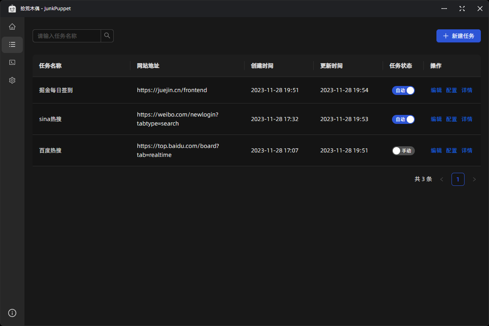
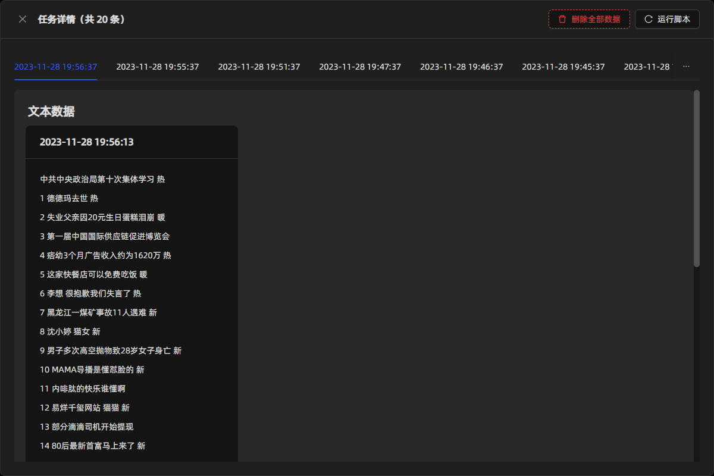
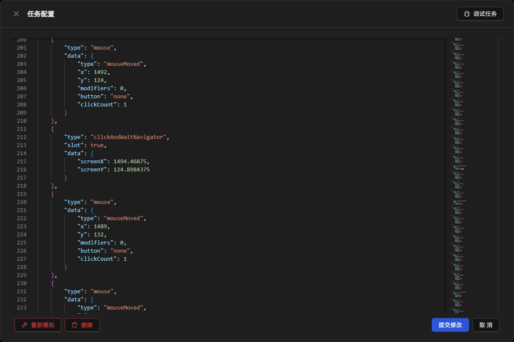

# 拾荒木偶 - JunkPuppet

## 什么是拾荒木偶？

`拾荒木偶`是一款基于 [Electron](https://github.com/electron/electron) + [Puppeteer](https://github.com/puppeteer/puppeteer) 的可视化爬虫工具。下载即用，无任何依赖。可用于执行浏览器自动化任务、信息采集。无需代码，操作简单，图形化界面，模拟人手操作对抗反爬。

- GitHub [https://github.com/qianqianhaiou/JunkPuppet](https://github.com/qianqianhaiou/JunkPuppet)
- Gitee [https://gitee.com/sunsilent/JunkPuppet](https://gitee.com/sunsilent/JunkPuppet)

## 获取拾荒木偶

进入 [GitHub Releases Page](https://github.com/qianqianhaiou/JunkPuppet/releases) 下载最新版本

如果下载速度慢或进不去 GitHub，可以使用[Gitee Releases Page](https://gitee.com/sunsilent/JunkPuppet/releases)

## 说明书
**完整文档** 请查看 [**https://sunsilent.gitee.io/junk-puppet-doc/**](https://sunsilent.gitee.io/junk-puppet-doc/)

## 软件截图

### 掘金自动签到

### 开启定时任务，爬取新浪热搜，自动执行

### 截取新浪热搜每一条的元素

### JSON 数据格式，每一步均可配置

### 非常方便的嵌入式工具箱，满足你的大部分需求

### 选取元素高亮显示，简单易懂

### 对抗反爬

由于网络上运行着各种各样的爬虫，所以网站可能会对爬虫进行检测，并拦截掉那些爬虫。

拾荒木偶通过各种 模拟 + 修改 来伪装成真人操作，减少爬虫判定次数。

所有 fpscanner 测试现在都是绿色的、所有 intoli 测试和 areyouheadless 测试都是绿色的

## 声明

本软件不得用于商业用途，仅做学习交流
