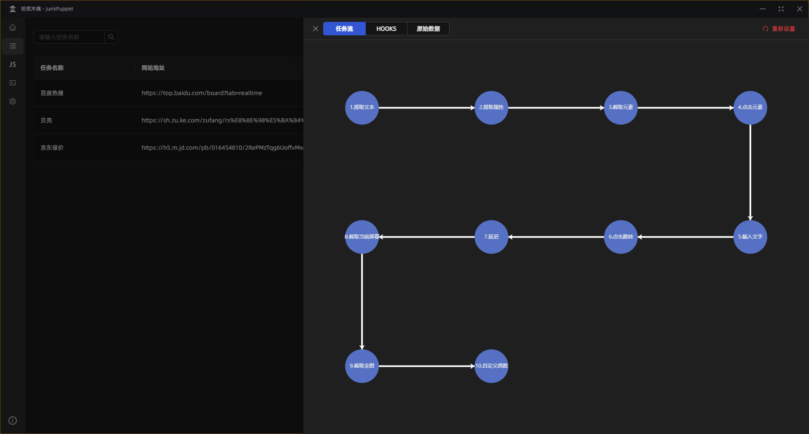
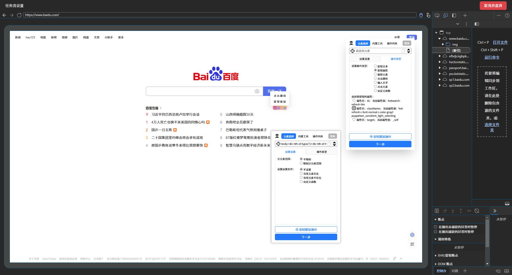
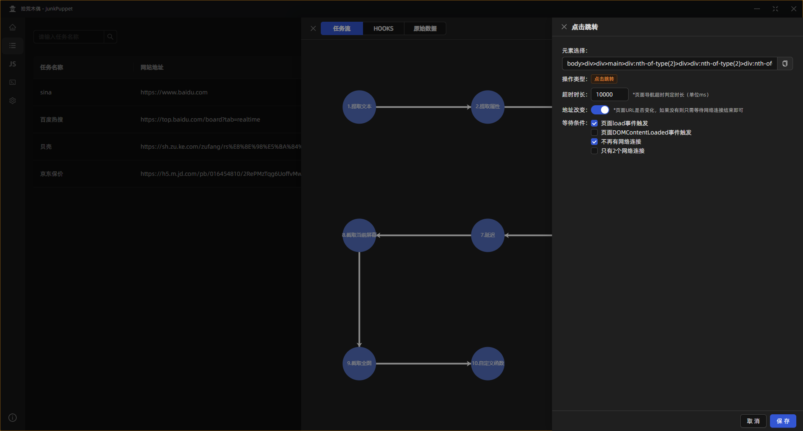
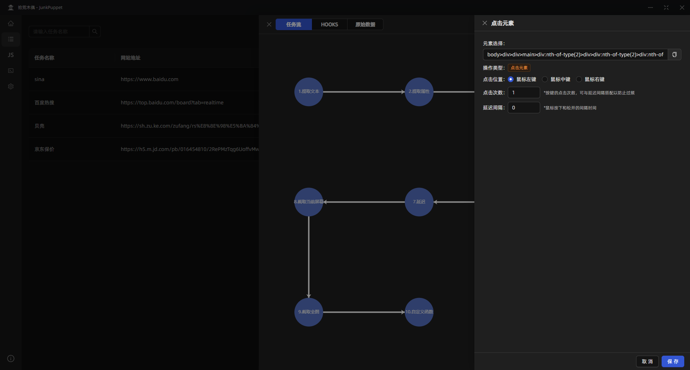
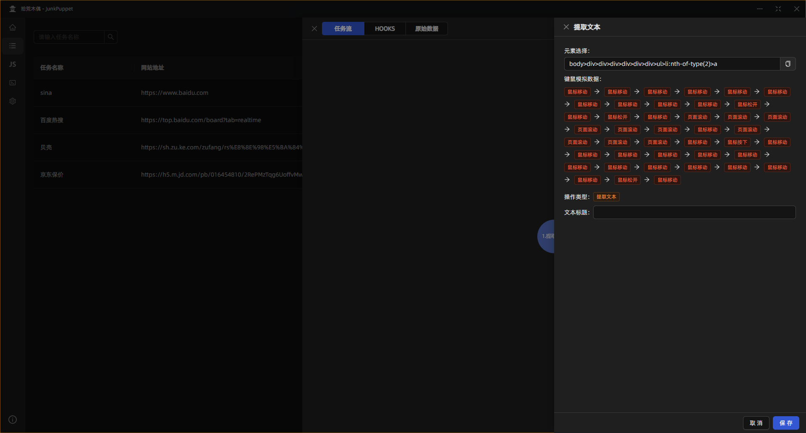
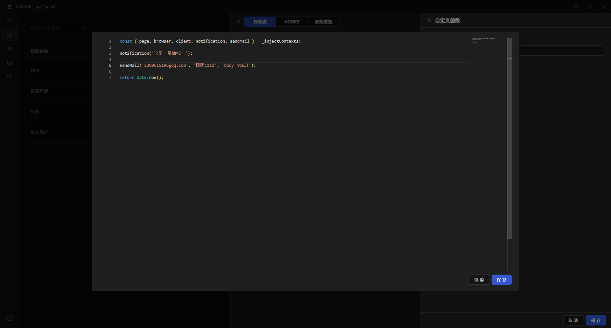
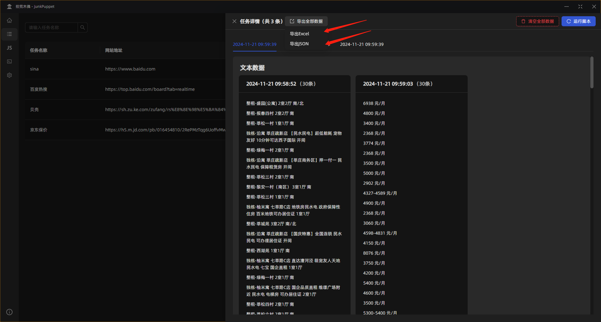
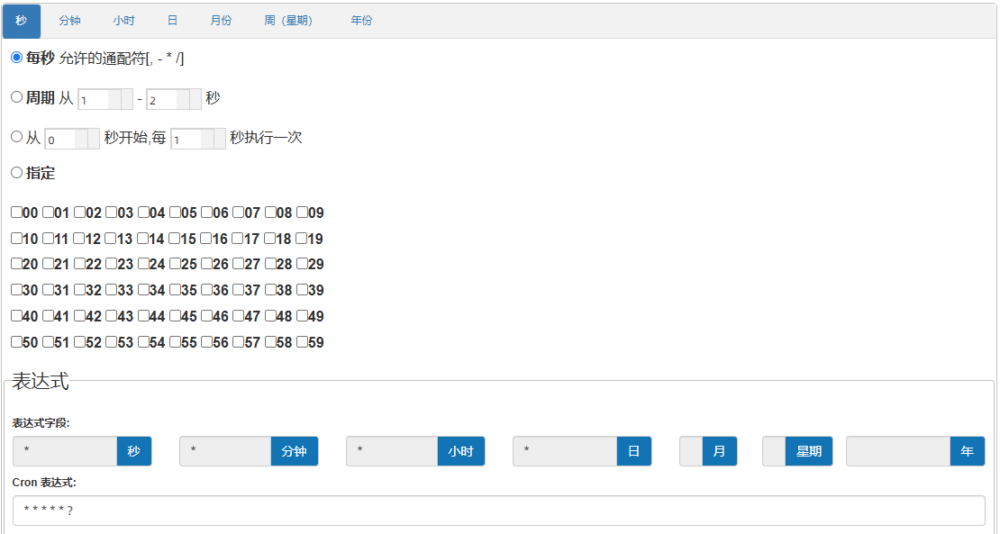
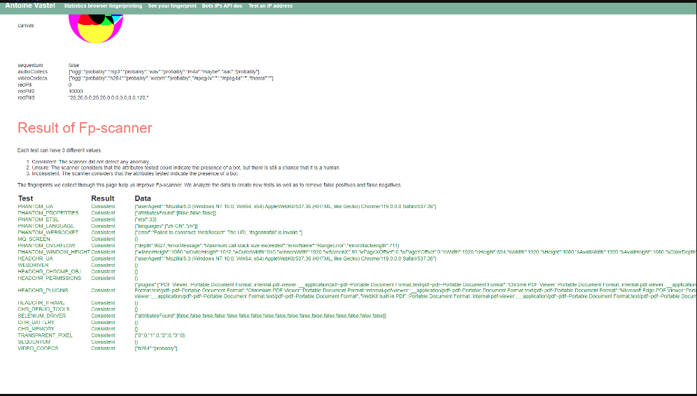
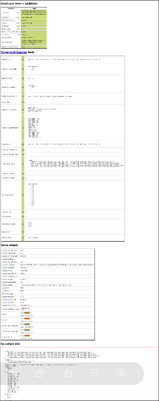

# 拾荒木偶 - JunkPuppet

> 进入 [GitHub Releases Page](https://github.com/qianqianhaiou/JunkPuppet/releases) 下载最新版本

> [使用说明: https://qianqianhaiou.github.io/JunkPuppetDoc/](https://qianqianhaiou.github.io/JunkPuppetDoc/)

## 什么是拾荒木偶？

`拾荒木偶`是一款借助 [Electron](https://github.com/electron/electron) + [Puppeteer](https://github.com/puppeteer/puppeteer) 技术构建而成的可视化爬虫工具。其具备便捷的下载即用特性，不存在任何外部依赖项。该工具能够被用于开展浏览器自动化任务以及信息采集工作。其操作方式极为简易，拥有图形化的操作界面，可通过模拟人手操作来有效对抗反爬机制。它还支持注入模拟键鼠事件以及自定义函数，足以应对百分之八十的自动化需求情形，为用户在相关领域的工作提供有力支持与高效解决方案。

## 鼠标点点点即可完成设置

仅需通过鼠标轻松点击，即可顺利完成各项设置。借助注入式工具箱，所有设置操作均可在单一页面内高效完成，无需在多个不同位置分别进行任务配置。该工具箱配备了元素高亮、相似元素选择等实用便捷功能，能够让您的操作过程更加流畅、高效且省心省力，显著提升操作的便捷程度与速度。

## 每一步的任务流均可配置

软件中每一步的任务流程均支持灵活配置，涵盖任务流的设定、生命周期钩子的调控以及原始数据格式的自定义处理。这种高度的灵活性使其能够广泛适配众多不同的应用场景，无论是复杂的业务流程还是特定的数据处理需求，皆能轻松应对，为用户提供了多样化且贴合实际需求的解决方案。

## 复杂的操作直接使用键鼠模拟数据

针对复杂的操作流程，软件可直接运用模拟人手对鼠标键盘进行操控来予以完成。如此一来，不仅能够确保操作的连贯性与流畅性不受影响，而且由于其高度贴近真实用户的操作行为模式，使得反爬机制更难以精准察觉与识别，从而为信息采集等任务的顺利推进提供了有力保障，极大地提升了在面对反爬限制情况下任务执行的成功率与稳定性。

## 更加灵活的自定义函数

软件具备更为灵活的自定义函数功能，能够广泛满足各式各样的应用场景需求。并且，这些自定义函数能够调用软件所开放的众多方法，从而得以借助系统丰富多样的功能，诸如邮件发送功能可用于任务执行结果的及时通报，桌面通知功能可在关键节点向用户推送重要信息提示等，极大地拓展了软件在不同业务场景下的实用性与功能性，为用户打造了一个功能强大且极具扩展性的操作平台。

## 灵活的数据导出方案

拥有极为灵活的数据导出方案，全面涵盖 Excel 与 JSON 两种主流格式。其中，Excel 格式能够以表格形式清晰呈现数据，使其更加直观易懂，方便用户直接查看与分析；而 JSON 格式则凭借其高度的灵活性，在数据的二次处理过程中展现出卓越优势，无论是数据整合、转换还是深度挖掘，都能轻松应对，为用户在数据处理与应用方面提供了丰富多样的选择，充分满足不同用户对于数据导出与后续利用的个性化需求。

## 后台运行，一次配置，长期执行

软件支持一次性配置后即可长期运行，用户可开启定时任务功能，通过设置 cron 表达式精准定义任务执行时间点，任务便能在预设时间自动于后台启动执行。在整个执行进程中，用户不会受到任何干扰，全程无感知，既确保了任务的按时推进，又不会对用户的正常工作与使用造成丝毫打扰，极大地提升了任务执行的自主性与便捷性，使用户能够高效地利用软件完成各类自动化任务安排。

## 对抗反爬

由于网络上运行着各种各样的爬虫，所以网站可能会对爬虫进行检测，并拦截掉那些爬虫。

拾荒木偶通过各种 模拟 + 修改 来伪装成真人操作，减少爬虫判定次数。
::: details 所有 fpscanner 测试现在都是绿色的、所有 intoli 测试和 areyouheadless 测试都是绿色的

:::

## 免责声明

本软件是一个开源软件，遵循MIT许可证的条款，您可以自由地使用、复制、修改和分发本软件及其源代码，无需支付任何费用，也无需通知作者或版权所有者。但您必须在本软件的所有副本中保留原有的版权声明和许可证声明。

本软件按“原样”提供，不作任何明示或暗示的保证，包括但不限于对适销性、适用性或不侵权的保证。在任何情况下，作者或版权所有者均不对因使用本软件或其源代码而引起的或与之相关的任何直接或间接的损害、责任或索赔负责，即使事先被告知此类损害的可能性。

您使用本软件及其源代码的风险由您自己承担，您应该自行评估和验证本软件的功能和质量。作者或版权所有者不对本软件的任何错误、缺陷或漏洞承担任何责任，也不负责提供任何技术支持或维护服务。

您应该遵守适用的法律法规，不得将本软件用于任何非法或不道德的目的，也不得侵犯他人的合法权益。如果您违反了本免责声明的任何条款，您的使用许可将自动终止，作者或版权所有者有权要求您停止使用本软件，并销毁本软件的所有副本。
